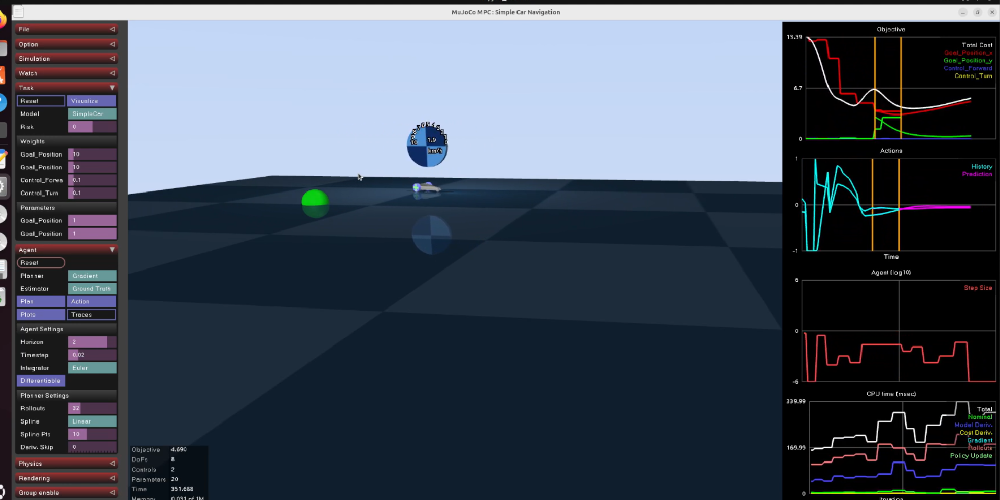
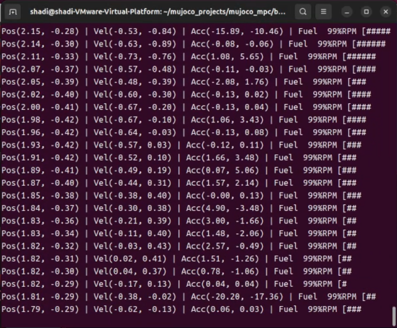

## 基于 MuJoCo MPC 的汽车仪表盘可视化系统

### 姓名：沙迪

### 学号：232011014

### 班级：计科2301

### 完成时间：2025 年 12 月25日

---

## 一、实验目的

本次课程设计的主要目的是通过实际动手完成一个综合性项目，加深对 **C++ 程序设计和工程开发流程** 的理解。本实验选取了 MuJoCo MPC 这一开源仿真框架，在其基础上进行二次开发，实现一个 **汽车仪表盘可视化系统**。

通过本实验，希望达到以下目标：

1. 熟悉大型 C++ 项目的代码结构和编译流程
2. 了解 MuJoCo 物理仿真引擎的基本使用方法
3. 学习从仿真系统中读取实时数据
4. 将仿真数据通过图形界面方式进行可视化显示
5. 提高分析问题和解决实际工程问题的能力

---

## 二、实验相关原理与技术

### 2.1 MuJoCo 物理仿真引擎简介

MuJoCo 是一款用于多刚体动力学仿真的物理引擎，能够高效模拟物体在重力、关节约束和接触条件下的运动情况。在本实验中，MuJoCo 主要用于模拟车辆模型的运动过程，并提供车辆的速度、位置等物理数据。

通过使用 MuJoCo，可以避免自己从零实现复杂的物理计算，使实验重点放在 **数据获取与系统集成** 上。

---

### 2.2 模型预测控制（MPC）概念

模型预测控制（MPC）是一种基于模型的控制方法，其基本思想是通过系统模型预测未来一段时间内的状态，并计算出最优的控制输入。MuJoCo MPC 项目将 MPC 算法与物理仿真相结合，为车辆仿真提供了较为完整的实验平台。

在本实验中，重点并不在于深入实现 MPC 算法，而是理解其整体框架，并利用其仿真结果进行可视化展示。

---

### 2.3 OpenGL 图形渲染

OpenGL 是一种常用的图形渲染接口。本实验使用 OpenGL 绘制二维图形，将汽车的速度、转速等信息显示为仪表盘界面，并以 HUD 的方式覆盖在 MuJoCo 的三维仿真画面之上。

---

## 三、实验环境与配置

### 3.1 硬件环境

* 处理器：x86_64 架构 CPU
* 内存：8GB 及以上
* 显卡：支持 OpenGL 3.3

### 3.2 软件环境

* 操作系统：Ubuntu 22.04
* 编译器：g++（支持 C++17）
* 构建工具：CMake
* 版本控制工具：Git
* 物理仿真引擎：MuJoCo（随 mujoco_mpc 项目编译）

---

### 3.3 编译与运行过程

```bash
git clone https://github.com/google-deepmind/mujoco_mpc.git
cd mujoco_mpc
mkdir build && cd build
cmake .. -DCMAKE_BUILD_TYPE=Release
cmake --build . -j4
./bin/mjpc --task=SimpleCar
```

经过多次尝试后，项目能够成功编译并正常运行。

---

## 四、系统整体设计

### 4.1 系统功能划分

整个系统主要分为以下几个部分：

1. **物理仿真模块**
   负责车辆模型的运动仿真，并计算车辆的速度和位置信息。

2. **数据获取模块**
   从 MuJoCo 的 `mjData` 数据结构中读取车辆的实时状态数据。

3. **仪表盘显示模块**
   使用 OpenGL 将仿真数据绘制成汽车仪表盘，并实时更新显示。

---

## 五、车辆模型与仿真场景

### 5.1 场景建模说明

实验中使用 MJCF（XML）格式描述车辆模型。模型主要由车身和车轮组成，并通过自由关节实现车辆整体运动。虽然模型结构相对简单，但能够满足实验对速度和位置数据的需求。





---

### 5.2 场景运行结果

通过加载车辆场景文件，仿真程序可以正常运行，车辆能够在仿真环境中运动，说明场景配置正确。

---

## 六、仪表盘设计与实现

### 6.1 设计思路

仪表盘采用二维 HUD 的方式进行绘制，直接叠加在三维仿真画面上。这种方式实现简单，不会影响原有的仿真渲染流程，且能够直观地展示车辆状态信息。

---

### 6.2 实现功能

目前仪表盘实现了以下功能：

* 车辆速度显示

* 发动机转速显示

* 数据实时更新

  

  

---

## 七、实验结果与分析

实验结果表明，程序可以稳定运行，车辆状态数据能够正确获取，并实时反映在仪表盘界面上。仪表盘显示随着车辆运动发生变化，达到了实验预期效果。
